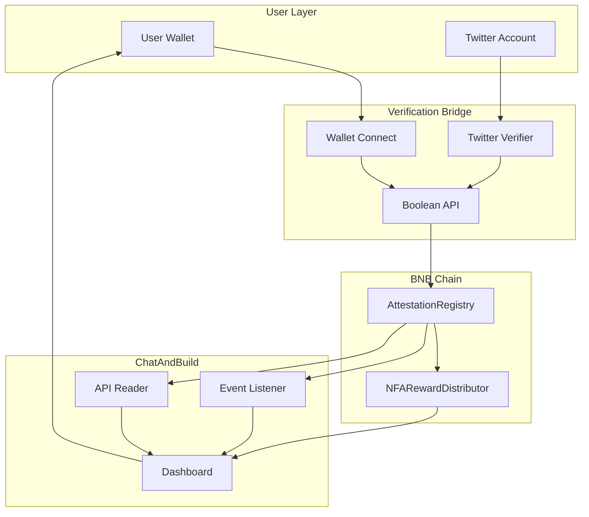
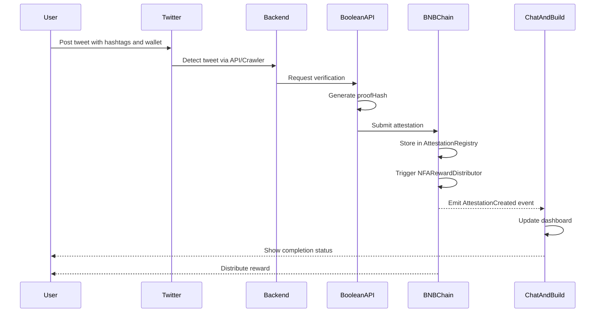
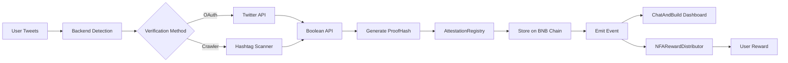
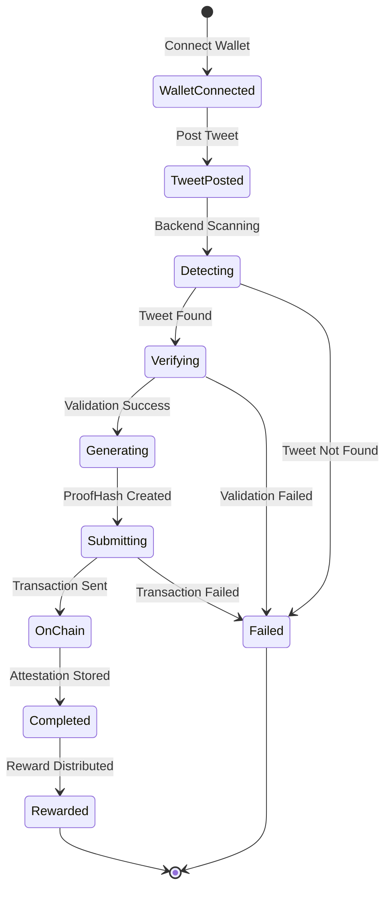
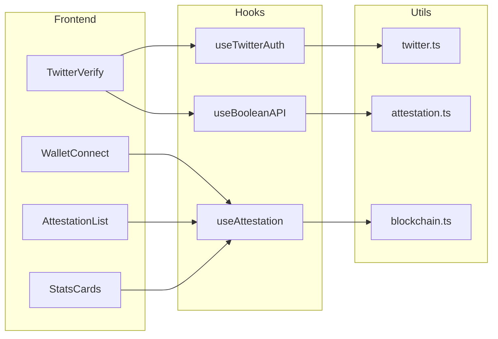
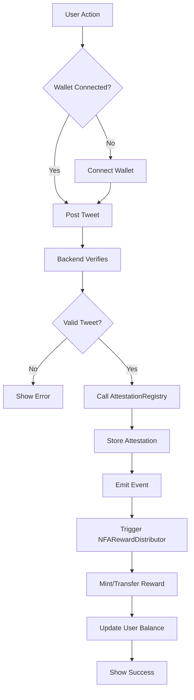
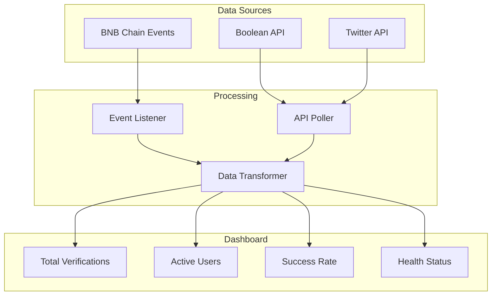

# NFA Twitter Verification & On-Chain Attestation Bridge

A trust bridge system that verifies Twitter social actions off-chain and attests them on-chain for ChatAndBuild to read via Boolean API or BNB Chain events.


## 🏗️ System Architecture



## 🔄 Verification Flow



## 📊 Data Flow



## 🔐 Attestation Process



## 🎯 Component Interaction



## 🔄 Smart Contract Flow



## 📈 Monitoring Dashboard Flow



### Flow Breakdown

### 1. Wallet Binding
- User connects via **BNB Chain Wallet** 
- Wallet address stored for attestation linkage

### 2. Off-Chain Twitter Verification

**Option A: Twitter OAuth API** (Recommended)
- Real-time verification
- Direct API access
- Instant feedback

**Option B: Hashtag Crawler**
- 1-3 minute delay
- Fallback option
- No OAuth required

### 3. Boolean API Attestation

**Attestation Payload Structure:**
```typescript
{
  walletAddress: string;    // User's BNB Chain address
  taskId: string;           // Unique task identifier
  tweetId: string;          // Twitter post ID
  proofHash: string;        // SHA-256 hash of verification data
  timestamp: number;        // Unix timestamp
  signature: string;        // Cryptographic signature
}
```

**Smart Contract Integration:**
- `AttestationRegistry`: Stores verified attestations on BNB Chain
- `NFARewardDistributor`: Distributes rewards based on verified tasks

### 4. ChatAndBuild Dashboard Integration

ChatAndBuild can read verified tasks via:
- **Boolean API Query**: REST endpoint for attestation lookup
- **BNB Chain Events**: Listen to `AttestationCreated` events
- **Real-time Dashboard**: Live feed of verified social actions

## 🚀 Getting Started

### Prerequisites
- Node.js 18+ 
- npm or yarn
- BNB Chain wallet (for testing)
- Twitter Developer Account (for OAuth option)


## 🛠️ Tech Stack

- **Frontend**: React 18, TypeScript, Vite
- **Styling**: Tailwind CSS (Neo-Brutalism theme)
- **Charts**: Recharts
- **Icons**: Lucide React
- **Blockchain**: BNB Chain, Thirdweb SDK
- **APIs**: Twitter API, Boolean API

## 📦 Project Structure

```
nfa-twitter-verification-bridge/
├── src/
│   ├── components/
│   │   ├── Dashboard.tsx          # Main dashboard
│   │   ├── WalletConnect.tsx      # Thirdweb wallet integration
│   │   ├── TwitterVerify.tsx      # Twitter verification UI
│   │   ├── AttestationList.tsx    # Attestation history
│   │   └── StatsCards.tsx         # Statistics display
│   ├── hooks/
│   │   ├── useTwitterAuth.ts      # Twitter OAuth logic
│   │   ├── useBooleanAPI.ts       # Boolean API integration
│   │   └── useAttestation.ts      # Smart contract interaction
│   ├── utils/
│   │   ├── twitter.ts             # Twitter API helpers
│   │   ├── attestation.ts         # Attestation generation
│   │   └── blockchain.ts          # BNB Chain utilities
│   ├── types/
│   │   └── index.ts               # TypeScript definitions
│   ├── App.tsx
│   ├── main.tsx
│   └── index.css
├── public/
├── package.json
├── vite.config.ts
├── tailwind.config.js
├── tsconfig.json
└── README.md
```

## 🔐 Security Considerations

- **Rate Limiting**: Twitter API has rate limits (consider caching)
- **Proof Verification**: All attestations are cryptographically signed
- **Smart Contract Audits**: Ensure AttestationRegistry is audited before mainnet

## 🧪 Testing

```bash
# Run linter
npm run lint

# Build for production
npm run build

# Preview production build
npm run preview
```

## 📊 Monitoring & Analytics

The dashboard provides real-time metrics:
- Total verified tasks
- Active users
- Attestation success rate
- Twitter API health status
- BNB Chain transaction status

## 🤝 Integration Guide for ChatAndBuild

### Reading Attestations via Boolean API

```typescript
// Query attestation by wallet address
const response = await fetch(
  `${BOOLEAN_API_ENDPOINT}/attestations/${walletAddress}`,
  {
    headers: {
      'Authorization': `Bearer ${BOOLEAN_API_KEY}`
    }
  }
);

const attestations = await response.json();
```

### Listening to BNB Chain Events

```typescript
// Listen for AttestationCreated events
const contract = new ethers.Contract(
  ATTESTATION_REGISTRY_ADDRESS,
  ABI,
  provider
);

contract.on('AttestationCreated', (walletAddress, taskId, proofHash) => {
  console.log('New attestation:', { walletAddress, taskId, proofHash });
  // Trigger reward distribution
});
```

## 🐛 Known Issues

- Twitter API rate limits may cause delays during high traffic
- Hashtag crawler option has 1-3 minute latency
- BNB Chain gas fees may fluctuate

## 📝 License

MIT License - See LICENSE file for details

